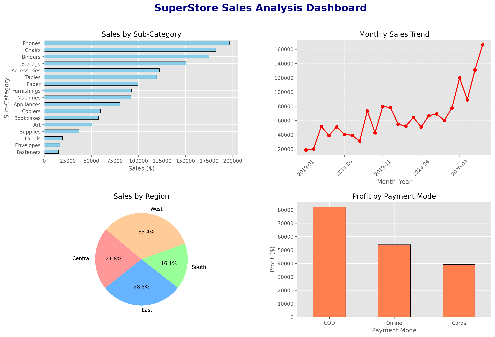

# SuperStore Sales Analysis: Power BI & Python Dashboard 📊

Is repository mein maine **SuperStore Sales Dataset** ka detailed analysis kiya hai. Maine pehle iska analysis **Power BI** mein kiya tha aur ab use **Python (Pandas & Matplotlib)** ke saath replicate kiya hai taaki business insights aur automation dono ko dikha saku.

## 🚀 Project Overview
Is project ka maqsad retail sales data se business-critical insights nikalna hai. Maine niche diye gaye key metrics par focus kiya hai:
- **Sales Performance:** Category aur Sub-category wise revenue.
- **Trend Analysis:** Monthly aur Yearly sales patterns.
- **Regional Insights:** Geographic distribution of sales and profit.
- **Operational Efficiency:** Shipping modes aur Payment methods ka analysis.

## 🛠️ Tech Stack
- **Data Analysis:** Python (Pandas)
- **Data Visualization:** Matplotlib (Subplots used for dashboard look)
- **BI Tool:** Power BI Desktop (`.pbix` file included)
- **IDE:** VS Code

## 📈 Key Visuals in Dashboard
Maine ek single-page dashboard create kiya hai jisme ye 4 main charts hain:
1. **Sales by Sub-Category:** Top performing products ki list.
2. **Monthly Sales Trend:** Saal bhar ka sales graph (Seasonality check).
3. **Sales by Region:** Pie chart jo market share dikhata hai.
4. **Profit by Payment Mode:** Cash, Online, aur Cards ke beech profit comparison.

## 🖼️ Dashboard Preview

*(Note: Agar aapne image ka naam badla hai toh yahan wahi naam likhein)*

## 💡 Business Insights (Results)
Dataset ko analyze karne ke baad ye main baatein nikal kar aayin:
- **Total Revenue:** ~$1.39 Million
- **Top Region:** **West** region sabse zyada profitable hai.
- **Best Month:** **December** mein sales peak par hoti hain (Holiday Season).
- **Preferred Payment:** Online payments aur COD ka trend barabar hai.

## 📂 Project Structure
```text
├── SuperStore_Sales_Dataset (1).csv   # Raw Data
├── analysis.py                        # Python Script for Analysis
├── Sales_Dashboard_Subplot.png        # Exported Dashboard Image
├── Sales Analysis Dashboard.pbix      # Power BI File
└── README.md                          # Project Documentation
